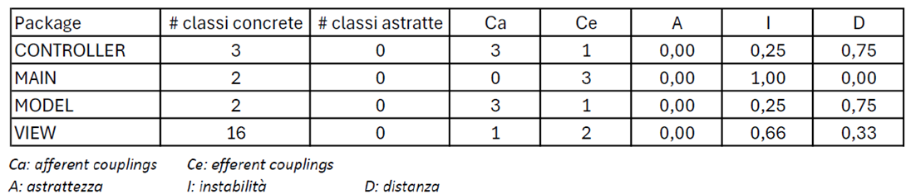

# QUALITA' DEL DESIGN

Per valutare la qualità del design, il team ha svolto alcune misurazioni del codice tramite il tool JDepend. Più in particolare queste misurazioni forniscono informazioni riguardanti l’estensibilità, la riusabilità e la manutenibilità del sistema. 

I risultati ottenuti:

Analisi dei risultati:

•	**Afferent coupling (CA)**: misura il numero di dipendenze da un pacchetto. Un alto valore indica che molte parti del codice dipendono dal pacchetto preso in esame. Essendo il nostro un progetto di dimensioni ridotte, abbiamo ottenuto un valore medio di CA  

•	**Efferent coupling (CE)**: misura quanto un pacchetto è dipendente da altri pacchetti in assoluto. Un alto valore indica che il pacchetto è fortemente dipendente dagli altri. Per lo stesso motivo sopra menzionato, il valore da noi ottenuto è medio  

•	**Astrattezza (A)**: misura il livello di astrazione del pacchetto. Non essendo presenti classi astratte nel nostro progetto, ovviamente abbiamo ottenuto un valore nullo  

•	**Instabilità (I)**: misura quanto il pacchetto è incline a subire cambiamenti da parte degli altri pacchetti. Pacchetti con elevata instabilità possono richiedere una maggiore attenzione durante lo sviluppo la manutenzione del software. Nel nostro caso, un valore alto di instabilità della classe main si spiega dal fatto che dipende da tutto, ma ha scarse funzionalità; le classi controller e model invece hanno valori contenuti perché svolgono la maggior parte delle funzioni; la classe view invece, svolgendo diverse azioni ma dipendendo da controller, ha un valore medio  

•	**Distanza (D)**: misura il valore di dipendenza con altri pacchetti in percentuale. Un alto valore indica che il pacchetto è molto isolato dagli altri. Nel nostro caso, valori nulli di astrattezza aumentano la distanza e quindi peggiorano estensibilità e riusabilità  

